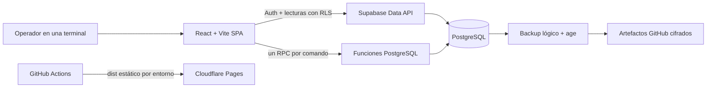
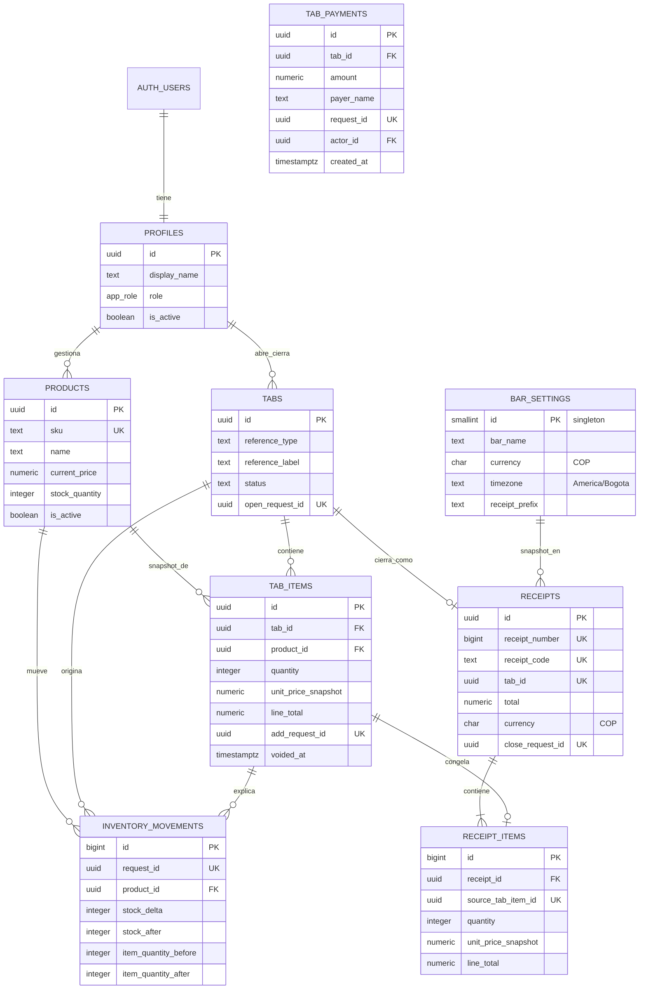

# Arquitectura y contrato de datos

## Vista general

Cloudflare solo aloja archivos estáticos. Supabase autentica, aplica RLS y ejecuta las
transacciones. El navegador puede leer las tablas/vistas autorizadas, pero las mutaciones
operativas pasan por RPC.

## Modelo entidad-relación

`tab_items` y `receipt_items` guardan snapshots de nombre, SKU y precio. Los totales de
cuentas abiertas suman líneas no anuladas; `receipts.total` queda congelado. Las tablas
históricas usan relaciones restrictivas y no se eliminan en cascada.

## Superficie de lectura

- `profiles`, `bar_settings`, `products`, `tabs`, `tab_items`, `receipts` y
  `receipt_items`, filtradas por RLS.
- `open_tabs_summary(id, reference_type, reference_label, status, opened_at, opened_by,
total, item_count)` para listar cuentas sin mantener un total duplicado.
- `inventory_movements` es historial append-only; su lectura administrativa no implica
  permiso para modificarlo.

## Contrato RPC

Todas las funciones retornan un envelope JSONB con `ok`; los errores incluyen código y
mensaje. Los UUID de solicitud se generan una vez por intención del operador y son
globalmente únicos entre RPC.

| RPC                     | Argumentos                                                       | Resultado principal       |
| ----------------------- | ---------------------------------------------------------------- | ------------------------- |
| `open_tab`              | `p_reference_type`, `p_reference_label`, `p_request_id`          | `tab`                     |
| `create_product`        | `p_sku`, `p_name`, `p_price`, `p_opening_stock`, `p_request_id`  | `product`                 |
| `update_product`        | `p_product_id`, `p_sku`, `p_name`, `p_price`, `p_is_active`      | `product`                 |
| `set_stock`             | `p_product_id`, `p_counted_quantity`, `p_reason`, `p_request_id` | `product`                 |
| `add_consumption`       | `p_tab_id`, `p_product_id`, `p_quantity`, `p_request_id`         | `tab`, `item`, `product`  |
| `set_tab_item_quantity` | `p_item_id`, `p_new_quantity`, `p_request_id`                    | `tab`, `item`, `product`  |
| `void_tab_item`         | `p_item_id`, `p_request_id`                                      | `tab`, `item`, `product`  |
| `cancel_empty_tab`      | `p_tab_id`, `p_request_id`                                       | `tab`                     |
| `close_tab`             | `p_tab_id`, `p_request_id`                                       | `tab`, `receipt`, `items` |
| `add_tab_payment`       | `p_tab_id`, `p_amount`, `p_payer_name`, `p_request_id`            | `payment`, `paid_total`, `balance` |

No se aceptan desde el cliente precio snapshot, total, actor, stock resultante ni número
de recibo. `update_product` es una edición administrativa y no cambia inventario; el
conteo usa `set_stock` para dejar movimiento y motivo.

## Invariantes operativas

- Cantidades y stock son enteros; stock nunca es negativo.
- Precios y totales son `numeric(14,2)`, en COP.
- Solo una terminal opera el MVP, pero RPC, bloqueos e idempotencia protegen doble clic y
  reintentos de red.
- Editar una cantidad devuelve o descuenta solo la diferencia.
- Anular devuelve toda la cantidad; la línea queda visible como anulada.
- Solo se cancela una cuenta sin consumos vigentes.
- Los abonos son registros append-only; la cuenta no se cierra hasta que lo abonado cubra el total vigente.
- Nuevos consumos se permiten después de abonos, pero no se puede reducir el total por debajo de lo ya pagado.
- Una cuenta cerrada, recibo y movimientos no se modifican; el código `REC` identifica
  un comprobante interno, no un documento fiscal.
